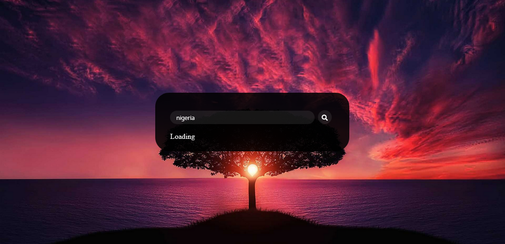

<!-- PROJECT SHIELDS -->
[![Contributors][contributors-shield]]()
[![MIT License][license-shield]][license-url]
[![LinkedIn][linkedin-shield]][linkedin-url]

<!--  -->

<!-- PROJECT LOGO -->
 

  

  <h3 align="center">Weather App</h3>

  

     
    <a href="https://harkanni.github.io/weather-report/">View Demo</a>
    ·
    <a href="https://harkanni.github.io/weather-report/issues">Report Bug</a>
  

<!-- TABLE OF CONTENTS -->
## Table of Contents

* [About the Project](#about-the-project)
  * [Built With](#built-with)
* [Contributing](#contributing)
* [License](#license)
* [Let's Get Social](#lets-get-social)
* [Contact](#contact)
* [Acknowledgements](#acknowledgements)

<!-- ABOUT THE PROJECT -->
## About The Project

Sometimes its good to have a 
This Application Provides Official Weather Information of any country or place in the world. 
You can access the current weather data for any location on Earth including over 200,000 cities! The data is frequently updated based on the global and local weather models, satellites, radars and a vast network of weather stations managed by openweathermap.  
This data is being supplied by [![https://www.openweathermap.io][open-weathermap-image]](https://openweathermap.org/), openweathermap makes official weather observations in their respective countries. Links to their official weather service websites and API services are listed below.
Weather icons are also shown alongside worded forecasts in this version to facilitate visual inspection.

<!-- Every great developer has a personal website filled with amazing examples of their code - Here's mine. Interested in working together or hiring me for your project? Contact me at  -->codeguydrew@gmail.com

### Built With

* [HTML]
* [CSS]
* [Bootstrap](https://getbootstrap.com)
* [Javascript]
* [JQuery](https://jquery.com)

<!-- CONTRIBUTING -->
## Contributing

Contributions are what make the open source community such an amazing place to learn, inspire, and create. All contributions you make are **greatly appreciated**.

## How to contribute? 

1. Fork the Project
2. Create your Feature Branch (`git checkout -b feature/AmazingFeature`)
3. Commit your Changes (`git commit -m 'Add some AmazingFeature`)
4. Push to the Branch (`git push origin feature/AmazingFeature`)
5. Open a Pull Request

<!-- LICENSE -->
## License

Distributed under the MIT License. See `LICENSE` for more information.

<!-- LET'S GET SOCIAL -->
## Let's Get Social

* [Facebook](https://facebook.com/othneildrew)
* [LinkedIn](https://linkedin.com/in/akanniemmanuel)
* [Github](https://github.com/harkanni)
* [Instagram](http://instagram.com/)
* [Twitter](http://twitter.com/the_tech_lead)

<!-- CONTACT -->
## Contact
Interested in working together or hiring me for your project or you have a nice comment? Contact me at
Akanni Emmanuel - [https://linkedin.com/in/othneildrew](https://linkedin.com/in/akanniemmanuel) - sendaraven2@gmail.com

Project Link: [https://GetWeatherReport.io](https://harkanni.github.io/weather-report)

<!-- ACKNOWLEDGEMENTS -->
## Acknowledgements
* [GitHub Pages](https://pages.github.com)
* [Font Awesome](https://fontawesome.com)
* [FakeLoader.js](https://joaopereirawd.github.io/fakeLoader.js)
* [WOW.js](https://www.delac.io/wow)
* [OpenweatherMap](https://openweathermap.org/)

<!-- MARKDOWN LINKS & IMAGES -->
[contributors-shield]: https://img.shields.io/badge/contributors-1-orange.svg?style=flat-square
[license-shield]: https://img.shields.io/badge/license-MIT-blue.svg?style=flat-square
[license-url]: https://choosealicense.com/licenses/mit
[linkedin-shield]: https://img.shields.io/badge/-LinkedIn-black.svg?style=flat-square&logo=linkedin&colorB=555
[linkedin-url]: https://linkedin.com/in/akanniemmanuel
[product-screenshot]: ./images/app-ss.png
